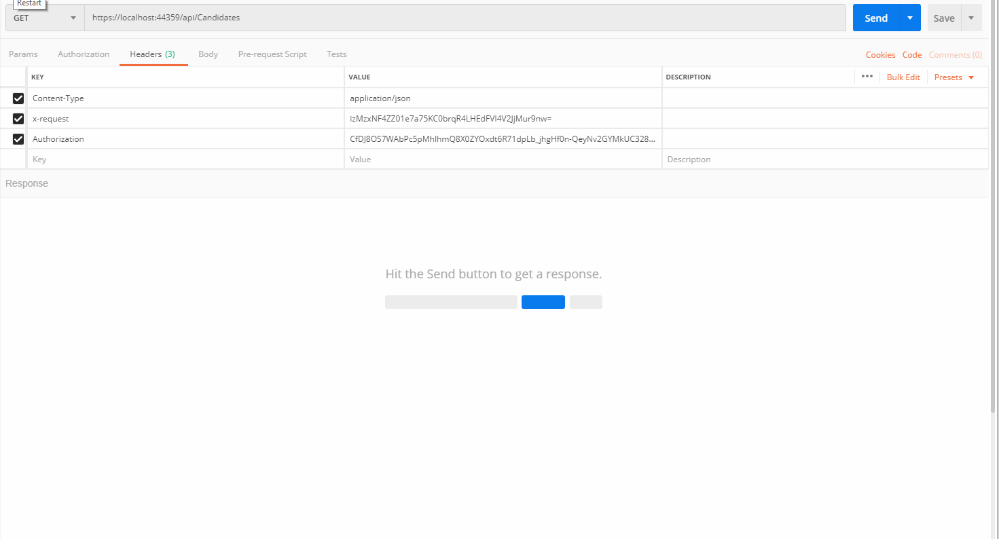

When you want basic data operations without any complexity and need to modify any of the custom business logic, basic controller is made. It includes methods which are used for simple CRUD operations.

The controller will be inherited from the class `BaseController` in which  `Model`, `View` and `RecordView` related to that entity are passed as a parameter. The controller will have a predefined route which include the controller name. For example: `[Route("api/Candidates")]`

The Candidate entity requires the basic data operations(Based upon the ResourceContext and ResourceUow created) to be done without addition of any custom business logic to be added. So we will generate a basic controller for the Candidate Entity of the ResourceModule.

> Name of that basic controller must have a suffix "Controller". For example: `CandidatesController`.

# Generate a Basic Controller

To Create a basic controller, open the `Package Manager Console` and run the following command:

> rxwebcore --controller --basic --main &ltController_Name&gt --uow &ltModule_Name&gt

Let's consider a scenario where you want a `CandidatesController` in the `ResourceModule`, you have to write:

> rxwebcore --controller --basic --main Candidates --uow Resource

In the above command, `basic` is the type of controller, `Candidates` is the name of the controller and `Candidate` is the name of the module. This command will create a separate folder named as "ResourceModule" and add a basic controller named as "CandidatesController" under the Api section of the project. 

# Methods

`BaseController` contain various methods used for Data interaction such as Get, Put, Post, Patch and Delete which will use the methods of Uow to interact with data. These methods are always public methods of the Controller as the controller class methods must be publically accessible to the specific action of the of the Controller. 

There are mainly 6 methods used for the Basic Controller which needs to be there in the BaseController which are as follows: 

<table class="table table-bordered">
<tr><th>Method</th><th>Return Type</th><th>Request Params</th><th>Request Body</th><th>Response</th></tr>
<tr><td>Get</td><td>IActionResult</td><td> - </td><td> - </td><td>complete list of that entity</td></tr>
<tr><td>GetById</td><td>IActionResult</td><td>Id of that entity which you want to get</td><td> - </td><td>Single entity based on the id</td></tr>
<tr><td>Post</td><td>IActionResult</td><td> - </td><td>New Entity object which you want to add</td><td>Ok()</td></tr>
<tr><td>Put</td><td>IActionResult</td><td>Id of that entity which you want to update</td><td>Complete entity object with the specific change which you want to update</td><td>NoContent()</td></tr>
<tr><td>Patch</td><td>IActionResult</td><td>Id of that entity which you want to update</td><td>entity object only with the specific change which you want to update in the form of `JsonPatchDocument`</td><td>NoContent()</td></tr>
<tr><td>Delete</td><td>IActionResult</td><td>Id of that entity which you want to delete</td><td> - </td><td>NoContent()</td></tr>
</table>

# Complete Example of Basic Controller 

Here is an example of a basic controller.

````js

    [ApiController]
    [Route("api/[controller]")]
	public class CandidatesController : BaseController<Candidate,vCandidate,vCandidateRecord>
    {
        public CandidatesController(ICandidateUow uow):base(uow) {}
    }

````

# Acessing The Api

For accessing the created Api, you must pass key and value of JWT token which is generated when the post request is called. For more information about creation of JWt web token Please refer <a class="redirect-link" href="/rx-web-core/step-by-step-guide/run-the-project">Login Api</a>.  

> The key is passed as `x-request` and value is passed as `Authorization`.



# See Also
Domain Controller